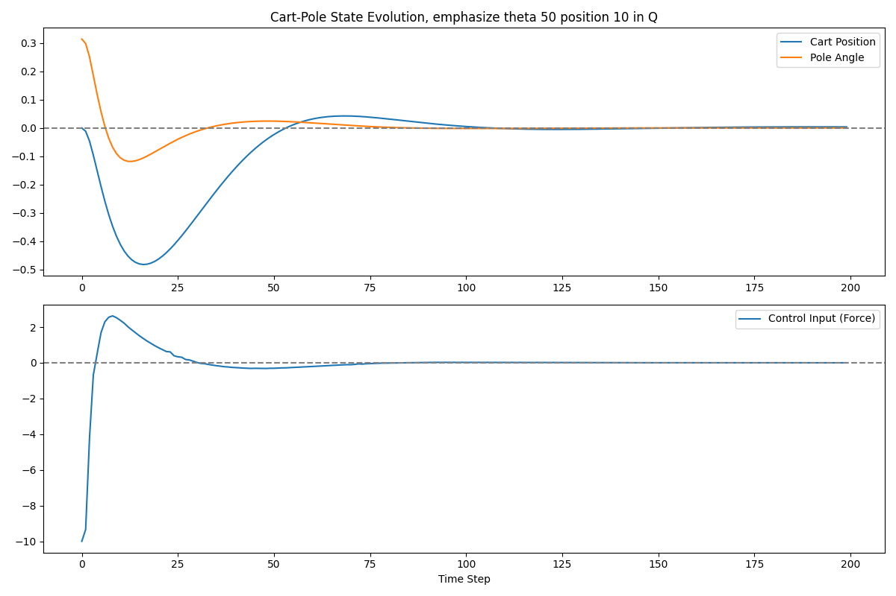

# Cart-Pole Model Predictive Control (MPC)

This repository contains a Model Predictive Control (MPC) implementation for a cart-pole system. The goal is to keep the pole balanced by applying forces to the cart using MPC to optimize control inputs over a prediction horizon.


## Example Plot

Below is an example plot showing the original and normalized PPG signal over time.



## System Overview

The cart-pole system is a classical control problem where a pendulum (pole) is attached to a cart. The goal is to apply forces to the cart such that the pole remains balanced in the upright position.

### System Dynamics

The system is modeled using a state-space representation with the following variables:

- `x[0]`: Position of the cart
- `x[1]`: Velocity of the cart
- `x[2]`: Angle of the pole
- `x[3]`: Angular velocity of the pole

The control input `u` is the force applied to the cart.

The linearized system dynamics around the upright position are given by the following state-space equations:

\[
x(k+1) = A_d \cdot x(k) + B_d \cdot u(k)
\]

Where:
- `x(k)` is the state at time step `k`
- `A_d` and `B_d` are the discretized state-space matrices
- `u(k)` is the control input (force applied to the cart)

### Discretization

To solve the system in discrete time, the continuous system is discretized using the Zero-Order Hold (ZOH) method. This results in the following discrete-time equations:

\[
x_{k+1} = A_d \cdot x_k + B_d \cdot u_k
\]

Where `A_d` and `B_d` are the discretized matrices computed based on the system's parameters and the sampling time `dt`.

## Model Predictive Control (MPC)

The goal of MPC is to compute an optimal control sequence that minimizes a cost function over a prediction horizon `N`. The cost function is defined as:

\[
J = \sum_{k=0}^{N-1} (x_k^T Q x_k + u_k^T R u_k)
\]

Where:
- `x_k` is the state at time step `k`
- `u_k` is the control input at time step `k`
- `Q` and `R` are weight matrices that penalize state deviations and control inputs

### MPC Optimization Problem

At each time step, the optimization problem solved by MPC is:

\[
\min_{U} J = \sum_{k=0}^{N-1} (x_k^T Q x_k + u_k^T R u_k)
\]

Where `U` is the control input sequence over the prediction horizon `N`.

### Code Walkthrough

```python
import numpy as np
import scipy.signal
import matplotlib.pyplot as plt
from scipy.optimize import minimize

# Cart-pole system parameters
m = 0.2     # Mass of the pendulum (kg)
M = 1.0     # Mass of the cart (kg)
l = 0.5     # Length of the pendulum (m)
g = 9.81    # Gravity (m/s^2)
dt = 0.05   # Time step (s)

# Linearized cart-pole dynamics (around the upright position)
A = np.array([
    [0, 1, 0, 0],
    [0, 0, m * g / M, 0],
    [0, 0, 0, 1],
    [0, 0, (M + m) * g / (M * l), 0]
])

B = np.array([[0], [1 / M], [0], [1 / (M * l)]])

# Discretize the system using Zero-Order Hold (ZOH) method
Ad, Bd, _, _, _ = scipy.signal.cont2discrete((A, B, np.eye(4), 0), dt)

# Cost matrices
Q = np.diag([10, 1, 50, 1])  # Penalize position, velocity, angle, and angular velocity
R = np.array([[0.1]])        # Penalize control input

# MPC parameters
N = 20  # Prediction horizon

# Cart-pole system dynamics
def cartpole_dynamics(x, u):
    u = float(u)  # Ensure u is a scalar
    x = x.reshape(4, 1)  # Ensure x is (4, 1)
    return Ad @ x + Bd * u

# MPC cost function
def mpc_cost(U, x0):
    U = U.reshape(N, 1)  # Ensure U is a column vector of shape (N, 1)
    x = x0.reshape(-1, 1)  # Ensure x0 is a (4, 1) column vector
    cost = 0
    for i in range(N):
        u = U[i].reshape(1, 1)  # Ensure u is a (1, 1) column vector
        x = cartpole_dynamics(x, u)
        cost += float(x.T @ Q @ x) + float(u.T @ R @ u)
    return cost

# Solve MPC optimization problem
def solve_mpc(x0):
    U0 = np.zeros(N)  # Initial control guess
    bounds = [(-10, 10)] * N  # Control force limits
    res = minimize(mpc_cost, U0, args=(x0,), bounds=bounds, tol=1e-4)
    return res.x if res.success else U0
